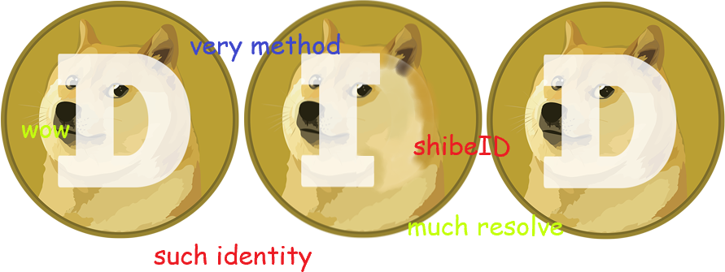

     

# did-doge
The Dogecoin DID Method (did:doge) is a means to give any 
shibe a decentralized identifier to use. 

The `did:doge` Decentralized Identifier Method Specification can be found 
[here](https://spruceid.github.io/did-doge/index.html).

The W3C Decentralized Identifiers (DIDs) v1.0 draft specification can be found 
[here](https://www.w3.org/TR/did-core/).

# Why a Dogecoin DID Method? 

- **Such Decentralization:** Dogecoin is a public, permissionless blockchain 
favored by Shiba Inus worldwide, making it suitable for this purpose. 
- **Much Identity:** Since shibes are unique in different and special ways,
this specification provides the means to assign each one their very own ShibeID.
- **Wow Blockchains:** Dogecoin has proven again and again its resiliency in 
the face of adversity, proving that it is the ultimate host to such a primitive. 